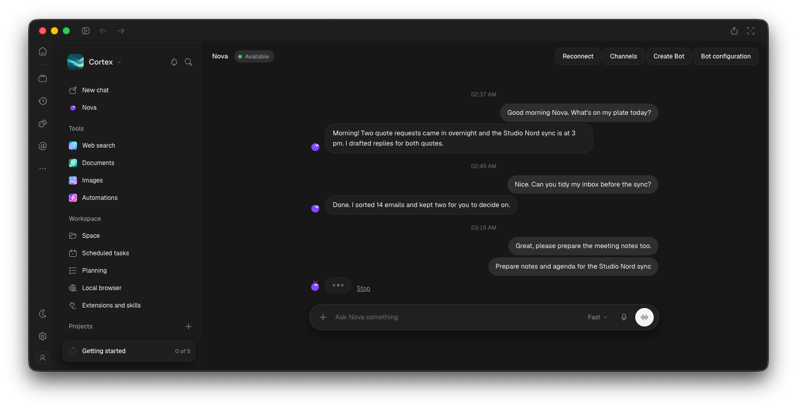

<h1 align="center">Cortex Desktop</h1>

<p align="center">
  <picture>
    <source media="(prefers-color-scheme: light)" srcset="docs/assets/banner-light.png">
    
  </picture>
</p>

<p align="center">
  <b>The desktop app for Chat, Work, Bots and Code, built on an agent engine that runs on your machine.</b> It's for people who want to talk to models they choose, keep their sessions and keys local, and optionally sign in to Cortex Cloud for Bots and remote workspaces.
</p>

<p align="center">
  <a href="LICENSE"></a>
  
  
  
  
  
  
  <a href="https://github.com/CortexLM/desktop/actions/workflows/ci.yml"></a>
</p>

<p align="center">
  <a href="docs/README.md">Documentation</a> ·
  <a href="https://cortex.foundation">Website</a> ·
  <a href="docs/getting-started.md">Getting started</a> ·
  <a href="docs/configuration.md">Configuration</a> ·
  <a href="docs/architecture.md">Architecture</a> ·
  <a href="docs/connection-modes.md">Connection modes</a> ·
  <a href="docs/providers.md">Providers</a> ·
  <a href="docs/testing.md">Testing</a> ·
  <a href="CONTRIBUTING.md">Contributing</a> ·
  <a href="SECURITY.md">Security</a> ·
  <a href="LICENSE">License</a>
</p>

> [!WARNING]
> **Alpha, not stable.** Cortex Desktop is under active development: screens, settings and stored data can change or break between commits, and nothing is guaranteed to be stable. Builds are **unsigned** (no code signing, no notarization). Do not use it in production or for anything you can't afford to lose.

---

## What is Cortex Desktop

Cortex Desktop is one Electron app. The agent engine lives in the app's main process, keeps sessions and settings in local SQLite (`node:sqlite`) and calls the model providers you configure. You don't need an account.

Three ideas hold it together:

1. **The engine is local.** Sessions, tools, permissions, MCP servers and skills run on your machine. The renderer is sandboxed and only talks to the engine through a small preload bridge.
2. **Keys stay in the main process.** Provider keys go into a separate credential store. They are write-only from the UI, and the renderer only ever sees the last four characters.
3. **Cloud is optional.** Sign in to Cortex Cloud (or a self-hosted server) with an email code to use Bots and the signed-in Work, Chat and Code screens. Local mode keeps working without it.

The banner is a real screenshot of the app: an unedited native macOS window capture (`screencapture -l` on macOS 26.6.2, Electron 44, dark theme, English), taken as is with the native window shadow and no mockup or recomposition. The Bot conversation is live code, but the screenshot feeds it **demo data**: a made-up Bot named Nova and invented messages, instead of a real Cortex Cloud account. No keys, emails or private paths appear.

## How it works

The renderer is a sandboxed React app. It never opens a socket and never sees a key: it calls `window.cortex`, a small preload bridge, which forwards requests over IPC (`cortex:fetch`) to the engine's route table in the main process, and events come back as a stream. Provider calls and the optional Cortex Cloud connection are made from the main process, and keys live in a separate credential store there. Details: [docs/architecture.md](./docs/architecture.md).

In the Bot conversation (signed in), you send a message and the Bot runs a job while typing dots show. If a tool needs permission it waits as a pending approval in the thread: Allow once lets it run, Deny skips the tool. Only safe metadata crosses to the renderer. See [AGENTS.md](./AGENTS.md) and [docs/connection-modes.md](./docs/connection-modes.md) for the exact contract.

---

## Features

What works today (see [Status](#status) for the exact boundaries):

- **Chat** on the local engine, streaming, with reasoning and image input for models that support them.
- **Work** tasks and approvals.
- **Bots** with mascots and an iMessage-style conversation. These screens need a Cortex Cloud sign-in.
- **Cortex Code** on a local folder.
- **Providers and models** from the public [models.dev](https://models.dev) catalog (Anthropic, OpenAI, Google and OpenAI-compatible endpoints).
- **MCP servers**, skills (a `summarize` skill ships in [`skills/`](./skills)) and optional [computer use](./docs/computer-use.md).
- **Eight locales** (`en fr es de ja zh-Hans pt-BR ko`), English by default, dark and light themes.

## Install

There are no signed releases yet. Build from source.

You need [Bun](https://bun.sh) 1.4 and Node 22 or newer.

```bash
git clone https://github.com/CortexLM/desktop.git
cd desktop
bun install
node node_modules/electron/install.js   # Bun skips Electron's postinstall
bun run build
bun run start
```

On a Linux machine without a display, install Xvfb and run `xvfb-run -a bun run start`. Keep the Chromium sandbox on: if Electron refuses to start because `chrome-sandbox` is not set up, run `sudo chown root node_modules/electron/dist/chrome-sandbox && sudo chmod 4755 node_modules/electron/dist/chrome-sandbox`. Only the automated Linux end-to-end tests pass `--no-sandbox` (see [`tests/e2e/fixtures.ts`](./tests/e2e/fixtures.ts)); never use it for normal use.

### Unsigned packages

```bash
bun run pack        # unpacked app in dist/, current platform
bun run dist:mac    # macOS dmg and zip (x64 and arm64)
```

`electron-builder.yml` also defines Windows (NSIS installer and portable, x64) and Linux (AppImage and deb, x64) targets. CI builds unsigned packages only.

| Platform | Notes |
| --- | --- |
| macOS | Unsigned. Gatekeeper will block the first launch; right-click the app and choose Open, or run `xattr -dr com.apple.quarantine /path/to/Cortex.app`. |
| Windows | Unsigned installers show a SmartScreen warning. |
| Linux | AppImage and deb. Credential encryption needs a keyring; without one the app refuses to persist cloud sign-in. |

---

## Quick start

1. Start the app (`bun run start`).
2. Open **Settings, Providers and models** and pick a provider.
3. Paste your API key. It is write-only: the app only keeps the last four characters for display.
4. Choose a model and start a chat.

More in [docs/getting-started.md](./docs/getting-started.md).

---

## Configuration

- **Providers:** [docs/providers.md](./docs/providers.md).
- **Connection modes** (local, Cortex Cloud, self-hosted): [docs/connection-modes.md](./docs/connection-modes.md). Pick one in Settings, Connection.
- **Overview and environment variables:** [docs/configuration.md](./docs/configuration.md).

## Keyboard basics

| Shortcut | Action |
| --- | --- |
| `Cmd/Ctrl+N` | New chat |
| `Cmd/Ctrl+K` | Command palette |
| `Cmd/Ctrl+B` | Toggle sidebar |
| `Cmd/Ctrl+,` | Settings |
| `Cmd/Ctrl+[` and `Cmd/Ctrl+]` | Back and forward |
| `Cmd/Ctrl+/` | Shortcuts |

---

## Architecture

| Package | Role |
| --- | --- |
| `packages/schema` | zod contracts, browser-safe |
| `packages/core` | Local engine: storage, providers, sessions, tools, permissions, agents, skills, MCP, bots, scheduler |
| `packages/protocol` | Hono route table and validation |
| `packages/server` | `createServer(core)`, called as `app.fetch` |
| `packages/client` | Typed fetch client and SSE parser |
| `packages/i18n` | Catalogs per locale and namespace |
| `packages/app` | Renderer: React 19, Base UI, Vite 8 |
| `packages/desktop` | Electron 44 main and preload, credentials, menu, Cloud probe and sign-in |

`vendor/` holds the vendored SDK tarballs, `tests/` holds unit and Playwright suites, `scripts/` holds the i18n audit, smoke tests and Mac capture tools. Details: [docs/architecture.md](./docs/architecture.md).

---

## Development

```bash
bun run lint
bun run typecheck
bun run test
bun run audit:i18n
bun run build && bun run test:e2e
```

Renderer only, in a browser:

```bash
bun run dev:api    # engine on :5298, in-memory keys
bun run dev:app    # Vite on :5299, proxies /api
```

Read [AGENTS.md](./AGENTS.md) and [`.rules/`](./.rules/) before you change code. Testing details: [docs/testing.md](./docs/testing.md).

---

## Status

- Live: Chat, Work tasks and approvals, Bots, Cortex Code on a local folder, Settings, Providers and models, connection selection with probing and email-code sign-in.
- Preview only: file viewers and other screens without engine wiring (open `#/gallery` in a preview build).
- Not built yet (waiting on design): Space, Scheduled, the Plugins and skills management screen, extra sign-in continuation screens. Remote prompt routing is pending.
- Sign-in lasts until Cortex closes. Prompts still use the local engine and the providers you configured.
- Acceptance is incomplete: see [evidence/STATUS.md](./evidence/STATUS.md).

---

## Documentation

Start at [docs/README.md](./docs/README.md). Highlights: [Getting started](./docs/getting-started.md), [Configuration](./docs/configuration.md), [Troubleshooting](./docs/troubleshooting.md), [FAQ](./docs/faq.md), [Architecture](./docs/architecture.md).

## FAQ

**Is it safe to use for real work?** It's alpha. Try it, don't depend on it. See the [FAQ](./docs/faq.md).

**Do I need an account?** No. Local mode works without one.

**Where is my data?** In the app's data directory, in local SQLite. Keys are in a separate credentials file with restricted permissions.

**Why is the app unsigned?** Release signing isn't set up yet.

---

## Contributing

Issues and pull requests are welcome. Read [CONTRIBUTING.md](./CONTRIBUTING.md) and the [Code of Conduct](./CODE_OF_CONDUCT.md). Use the issue templates for [bugs](https://github.com/CortexLM/desktop/issues/new?template=bug_report.yml) and [features](https://github.com/CortexLM/desktop/issues/new?template=feature_request.yml).

## Security

Report vulnerabilities privately, as described in [SECURITY.md](./SECURITY.md). Don't open a public issue for them.

## Community

- [Issues](https://github.com/CortexLM/desktop/issues) for bugs and requests.
- [CortexLM on GitHub](https://github.com/CortexLM) for the other repositories.

## License

Apache-2.0, see [LICENSE](./LICENSE) and [NOTICE](./NOTICE). Copyright 2026 Cortex Foundation / CortexLM.
