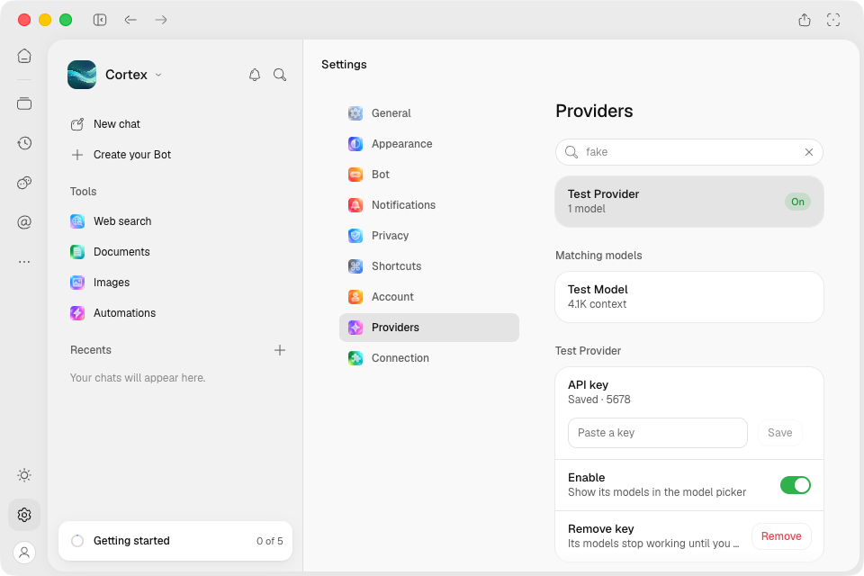
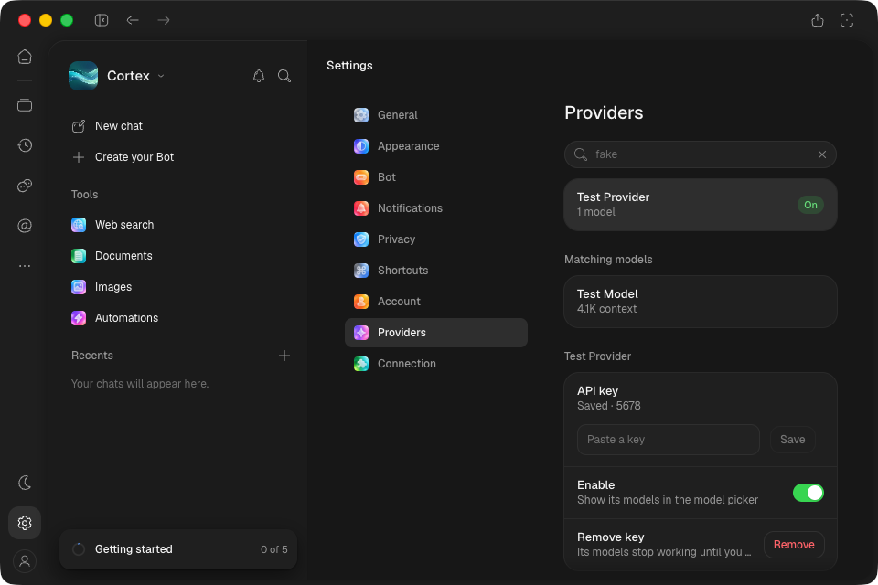

# Installed Mac provider key-row correction — 9d704ee

Exact unsigned arm64 artifact **11253755117**, [CI 37066222793](https://github.com/CortexLM/desktop/actions/runs/37066222793).
Application/source `9d704ee`; provider-row change follows the earlier `ca08282` MCP correction.

- ZIP SHA-256: `1ca63896aab2827aadad0539037d3100884368d29d922aaecae50aed4062d9fd`.
- Installed ASAR SHA-256: `489aeec814519ab949095de58acb8384c6076462f64299dfeaee6cc670046ffb`.
- All 90 embedded app/desktop build members match the local build. Eight locales, 13 catalogs each.
- GUI LaunchServices launch via `open -na /Applications/Cortex.app`; prior install retained as
  `/Applications/Cortex-before-9d704ee.app`.

## Assertions

At **960×640**, sidebar shown, light and dark:

- deterministic provider catalog loads;
- key saves through real IPC, input clears, `Saved · 5678` remains readable;
- label/hint range hit-testing passes, controls wrap without overlap or horizontal overflow;
- key remains absent from page content;
- renderer reload preserves the hint;
- no page errors observed after attachment.

Native screenshots include traffic lights and OS chrome:

`manifest.json` records geometry and redaction assertions. `native.log` records the final pass.
OS `screencapture` supplies pixels; CDP drives assertions. Save-toasts use real timers, with the
pointer outside the toast; reduced-motion preference is enabled. `cleanup.json` records debug/
capture port closure and installed ASAR; ordinary app restored and Mac lease released.

This is targeted minimum-window correction proof. It does not replace the revision-scoped full
native sweep, frozen comparison, remote inference proof or whole-product acceptance.
