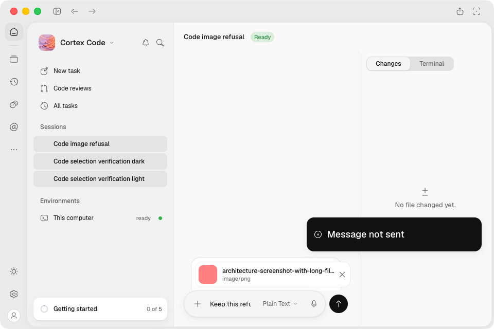
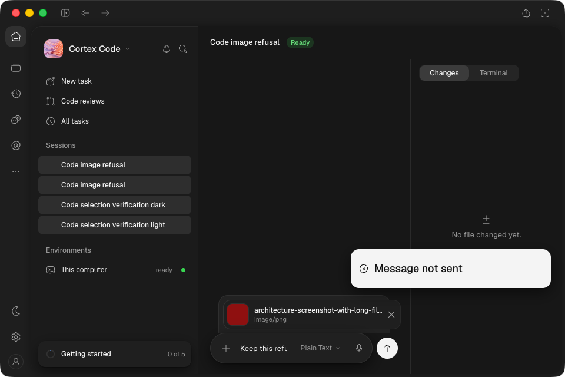
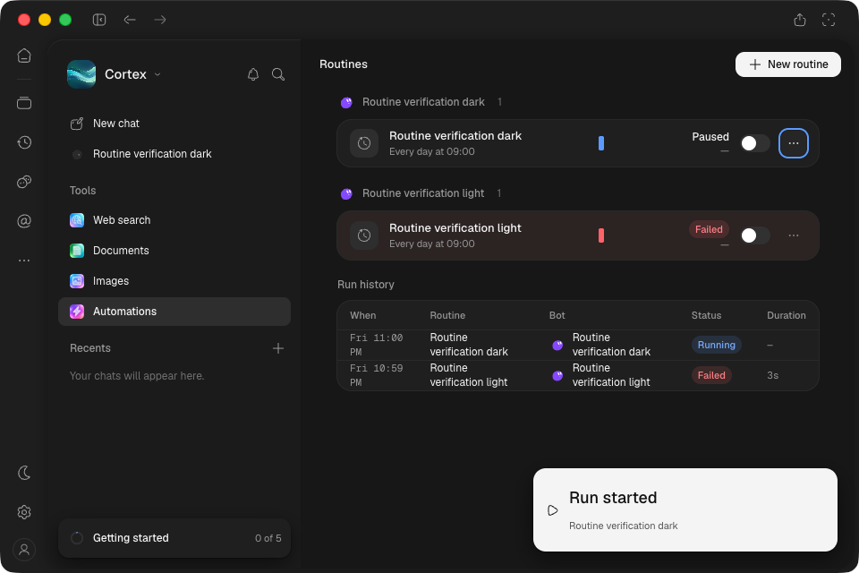
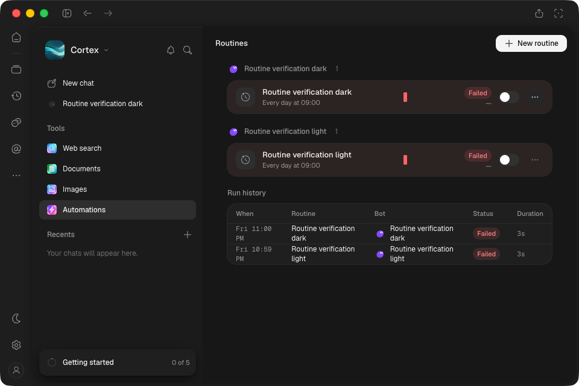

# Installed Mac Code and routine verification — d635fcf

Exact unsigned arm64 artifact **11255263779**, [CI 37074187552](https://github.com/CortexLM/desktop/actions/runs/37074187552).
The macOS job passes E2E/package/smoke; the overall run fails eight locale-render test fixtures.
Test-only correction `ea1c54b` changes no application/build/package inputs.

- ZIP SHA-256: `85192b7fef863e3d3c638d72e44d528ad392e1000bf1a91c46dfb53104b4958d`.
- Installed ASAR SHA-256: `aa11177040f5fd1e2367fad84575b23e85416bfdd64572e16e1686b0f166ee08`.
- All **90 embedded build members** match the local `d635fcf` build byte-for-byte.
- Eight locales, 13 catalogs each; fixture/source-stamp resources excluded.
- GUI LaunchServices launch using `open -na /Applications/Cortex.app`; isolated engine/profile,
  deterministic catalog, explicit keyless local provider configuration. Native folder test hook
  selects an isolated project; this is not native folder-picker interaction proof.
- Previous install retained at `/Applications/Cortex-before-d635fcf.app`.

## Verified at 960×640, sidebar shown, light and dark

1. Create Code task with Reasoner Large, follow up with Plain Text; persisted user/assistant model
   references and provider requests match. Reload restores Plain Text despite a different global preference.
2. Long-filename image refused by the text-only model; draft/file/history remain intact. Remove,
   model and input controls remain reachable. Selecting the image-capable model admits the original
   attachment once. Disabling that provider refuses the next send without changing history/draft.
3. Routine Run now enters Running while a real permission ask is pending. Duplicate API request
   returns 409, creates no second run; UI Run now is disabled. Abort persists `error`/`aborted`,
   and reloading shows Failed.
4. No page errors observed during the ten-capture primary run. Six Code inference requests plus two
   routine requests reached the deterministic provider: eight total. Primary-run refusals and
   duplicate starts produced none. The two supplemental toast checks record empty histories;
   their script does not install a separate page-error collector.

`manifest.json` stores ten initial native captures and assertions. Its `codeModelRequests` arrays
record persisted **message** models (user and assistant), not request counts; `provider-receipt.json`
records the eight actual requests. `images.json` binds all twelve PNGs to their hashes.

All twelve screenshots inspected full-size: native traffic lights/chrome present, both themes
readable, routine states visible, recovery controls clear. In the initial two attachment images,
the toast expired during native capture after its geometry/hit assertions. Two supplemental
`code-attachment-toast-*` captures hold the ordinary pointer over the toast and verify visibility
before/after capture: toast bottom **489px**, full dock top **501px**. No fake clock was used.

## Cleanup and limits

`cleanup.json` proves ports 9444/9445/9456 closed and the installed ASAR hash. Separate operator
observations: SSH forwards stopped, ordinary application reopened without test/debug overrides,
Mac lease released. Native helpers/provider stopped; prior packages and isolated evidence retained.

This is targeted installed-app proof with controlled inference. It does not refresh the historical
all-screen native/menu sweep, establish real-model reasoning/image understanding, prove remote
authentication/inference, or certify signing/public release. Process-restart routine recovery is
covered by the file-backed core regression; these native routine checks reload the renderer only.

[Independent review](independent-review.md) verifies the package, 90 build members, all locale
bytes and twelve image hashes; eight native images inspected separately, no scoped blocker.
Run `sha256sum -c SHA256SUMS` here to check the retained file bytes.
