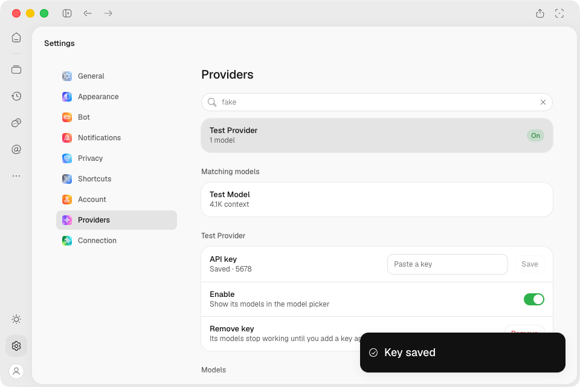
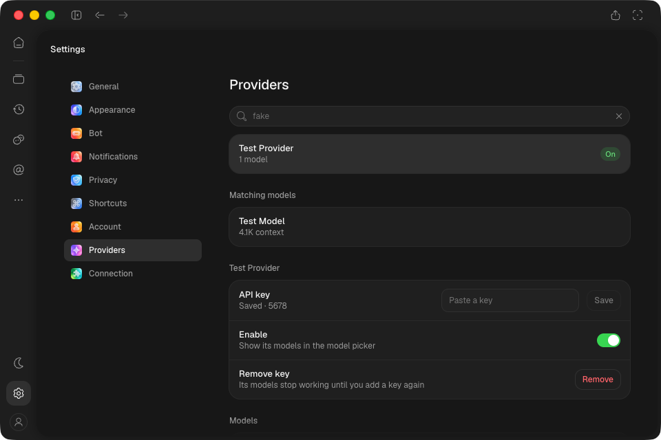

# Installed Mac MCP credential boundary — de623fd

Exact unsigned arm64 artifact **11251573733**, [CI 37063183382](https://github.com/CortexLM/desktop/actions/runs/37063183382).
Application source `ca08282`; `de623fd` changes the test harness/evidence only.

- ZIP `2a55a0a4b363d0ccfe7524e71c23dcd06e960785bb20015fc8697dfbaf954058`.
- Installed ASAR `ab3f0dbe97805964e4f86e73e0de923723f459db70aef861e7de0a3698aa5d5a`.
- All 90 embedded app/desktop build members match the then-local build; eight locales,
  thirteen catalogs each, no raw fixture/source-stamp resources.
- Launched through GUI `open -na /Applications/Cortex.app`, isolated profile/engine, deterministic
  test catalog. Prior installation retained as `/Applications/Cortex-before-de623fd.app`.

## Proven changed path

1. Save a provider test key through Settings; input clears, only the last four characters return.
2. Save disabled remote MCP config through real IPC; responses expose metadata only.
3. Disk check: fresh SQLite/WAL contain no sentinel connection/key plaintext; credential files
   use encrypted `e:` records and mode `0600`, SQLite contains metadata plus an opaque reference.
4. Quit/relaunch the app. Provider hint and disabled MCP metadata persist. Enable MCP: decrypted
   header/path reach a controlled local endpoint; initialize and tool discovery complete.
5. Remove MCP: public list and credential store are empty. Provider key remains intact.

`provider-receipt.json` records two handshakes, three requests each, all credential/path comparisons
true; no secret values logged. The first handshake preceded a capture-layout failure; the final
one follows the final quit/relaunch. No remote inference is involved.

Two OS-window captures at 960×640, light/dark, **sidebar hidden**; traffic lights included:

## Preserved failures and follow-up

The initial normal-sidebar capture found a real layout defect: key label/hint collapsed to
zero width (`provider-layout-before.json/png`). `save.log` preserves the unreadable-hint timeout.
Hiding the sidebar allowed credential-path verification; it does not resolve the defect. A separate
layout correction and both-theme regression follow; these captures do not establish that correction.

The first reconnect failed because the SSH-started helper did not run (`nohup` could not detach).
GUI-starting the helper recovered connection without app changes. `reopen.log` preserves failure;
`reopen-server-started.log` then reaches the already-known unreadable hint. Final successful logs
are distinct. No credentials were lost; the disabled record was reset before repeating save/reopen.

Native pixels came from OS `screencapture` via a GUI-authorized helper; CDP only drove assertions.
No renderer errors observed after each attachment. `cleanup.json` records ports 9444/9445/9456
closed and the installed ASAR hash. Operator observations separately confirm SSH forward shutdown,
ordinary app restoration and Mac lease release.
This is targeted credential proof; previous full-screen/native comparisons remain revision-scoped.
