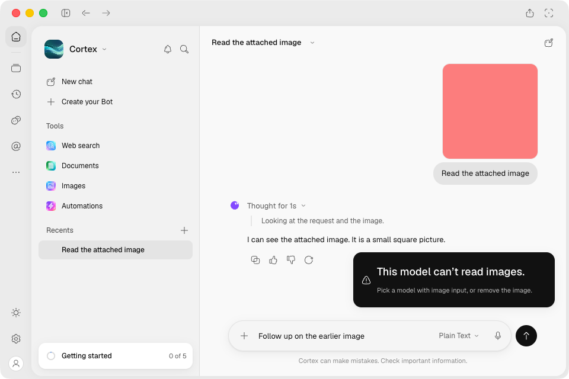
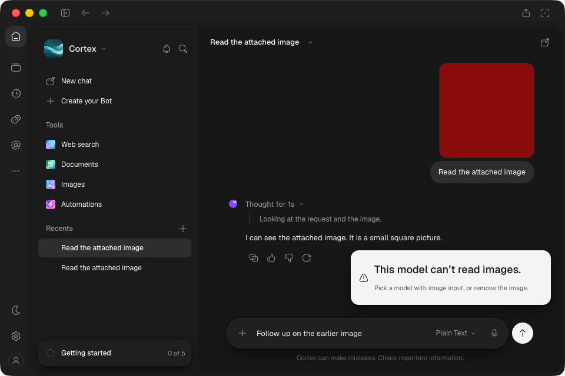

# Installed Mac admission correction — f2754be

Exact unsigned arm64 [artifact 11247882942](https://github.com/CortexLM/desktop/actions/runs/37055151545/artifacts/11247882942)
from [green CI 37055151545](https://github.com/CortexLM/desktop/actions/runs/37055151545).
Source `f2754bed27cfcc821a7e5bba8ce0d69cfa7e66f7`.

- ZIP SHA-256: `0ec445254581effe9a6de71b330b29c85625c847a31128c9085a85dcff9c8dab`.
- Installed ASAR: `535597af5221b7af50c43701f7e906b49cc7c3fcfc95cdbd535447afcbc81be0`.
- All **90 embedded app/desktop build members** match the local built bytes. Eight locales,
  thirteen catalogs each; no raw fixtures/source stamps in locale resources.
- GUI LaunchServices launch via `open -na /Applications/Cortex.app`, isolated profile/engine,
  English, local catalog with controlled provider endpoint. Packaged test-baseURL override is
  not used; the catalog supplies the endpoint. The prior installation is retained separately.

## Changed-path verification

Two native OS-window captures, **960×640**, light and dark, both inspected full-resolution:

`capture.mjs` drives the installed app through these assertions in each theme:

1. Send an image using an image-capable model; wait for successful persisted completion.
2. Choose a non-image model; type a text-only follow-up with no new composer attachment.
3. Send refuses with existing localized capability copy. Draft, two-message history and stored
   session model stay unchanged; input, model picker and send remain reachable.
4. Select the compatible model, send the retained text, verify four persisted messages and
   cleared composer. The fixture records **four provider requests total**, two per theme;
   refused follow-ups cause no request to the non-image model.

Zero renderer errors. Pixels use OS `screencapture` through the GUI-authorized helper; CDP
controls/assertions do not replace native pixels. Traffic lights/chrome are visible. Toast time
is paused for capture, advancing 100ms around menu interaction; CI uses real timers.

Initial setup used a `file://` catalog URL unsupported by Node fetch, so model selection timed
out before inference. That failed log is retained. Relaunch with the fixture as a `data:` URL
passed without application changes. The preceding SCP transfer timed out and was resumed with
`rsync --append-verify`; destination ZIP/ASAR hashes matched before launch.

Cleanup: helper stopped, remote ports 9444/9445 closed, SSH forwards and controlled provider
stopped, ordinary app reopened without debug/profile overrides, Mac lease released. Cleanup JSON
uses `true` to mean the port is closed. Provider receipt contains model/counts only, no credentials.

This is targeted installed-package proof. Renderer source is unchanged from `cc758a6`; its
[18 native captures](../cc758a6/README.md) and [5ced8aa full sweep](../5ced8aa/README.md) retain
their own revisions. No fresh all-screen sweep, menu suite, remote Cortex inference or whole-product
acceptance is claimed.
