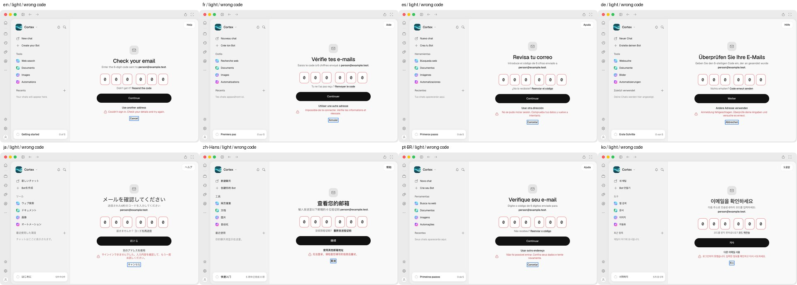
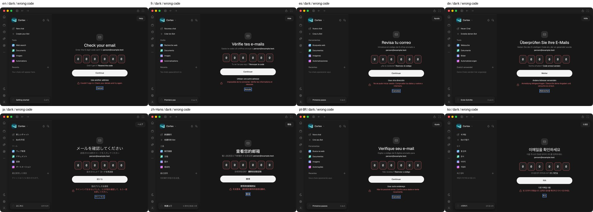

# Native wrong-code images — full-size review

All **16 originals** inspected individually at **960×640**. Links below retain exact
decoded RGBA. Each shows six zeros, localized refusal, enabled controls and the final
Cancel focus ring. No clipped primary text, overlapping control or missing glyph observed.

| Locale | Light | Dark | Observation in both themes |
| --- | --- | --- | --- |
| English (`en`) | [Full-size](images/auth-en-light-wrong-code.webp) | [Full-size](images/auth-en-dark-wrong-code.webp) | Single-line heading, lead and refusal. Cancel focus visible. |
| French (`fr`) | [Full-size](images/auth-fr-light-wrong-code.webp) | [Full-size](images/auth-fr-dark-wrong-code.webp) | Accents readable; two-line refusal clears alternate-address and Cancel controls. |
| Spanish (`es`) | [Full-size](images/auth-es-light-wrong-code.webp) | [Full-size](images/auth-es-dark-wrong-code.webp) | Two-line lead/refusal fit; code cells and controls remain clear. |
| German (`de`) | [Full-size](images/auth-de-light-wrong-code.webp) | [Full-size](images/auth-de-dark-wrong-code.webp) | Long heading stays within pane; umlauts and wrapped refusal readable. |
| Japanese (`ja`) | [Full-size](images/auth-ja-light-wrong-code.webp) | [Full-size](images/auth-ja-dark-wrong-code.webp) | Japanese glyphs visible in heading/sidebar/actions; two-line refusal fits. |
| Simplified Chinese (`zh-Hans`) | [Full-size](images/auth-zh-Hans-light-wrong-code.webp) | [Full-size](images/auth-zh-Hans-dark-wrong-code.webp) | Chinese glyphs visible; compact single-line refusal and focused Cancel clear. |
| Brazilian Portuguese (`pt-BR`) | [Full-size](images/auth-pt-BR-light-wrong-code.webp) | [Full-size](images/auth-pt-BR-dark-wrong-code.webp) | Diacritics and two-line refusal readable; buttons separate. |
| Korean (`ko`) | [Full-size](images/auth-ko-light-wrong-code.webp) | [Full-size](images/auth-ko-dark-wrong-code.webp) | Hangul visible throughout; single-line refusal clears focused Cancel. |

Native chrome/traffic lights and shown sidebar are present in every frame. Captured
app-window pixels are unobstructed; other OS windows/notifications are outside the
CGWindow capture. Signed-in and unavailable-enrollment have geometry records only in
this batch. Review attribution and acceptance limits: [README](README.md).

## Contact sheets — navigation only

[Exact image/provenance hashes](retained.json) · [48-view/control-order index](views.json)
