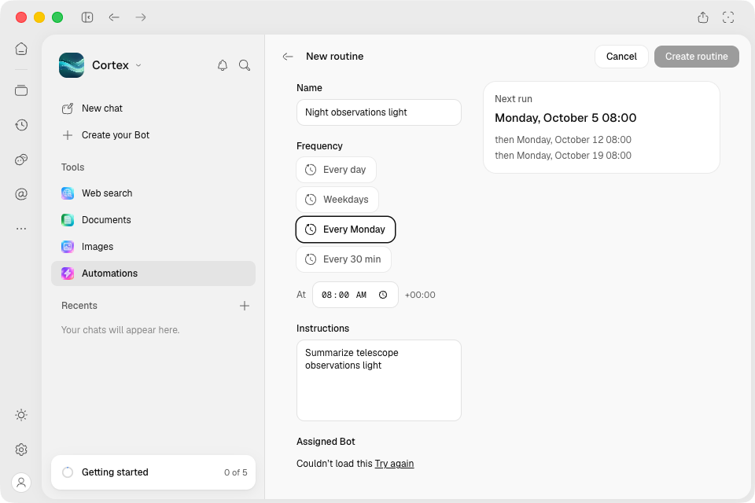
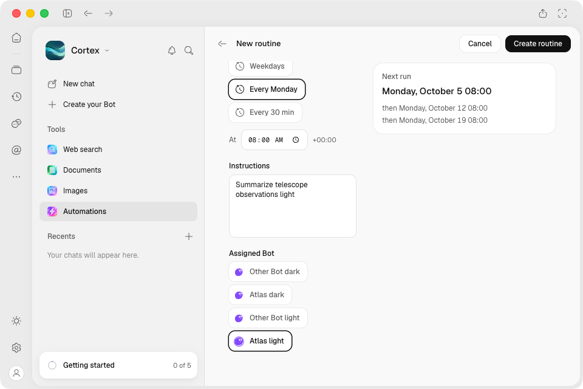
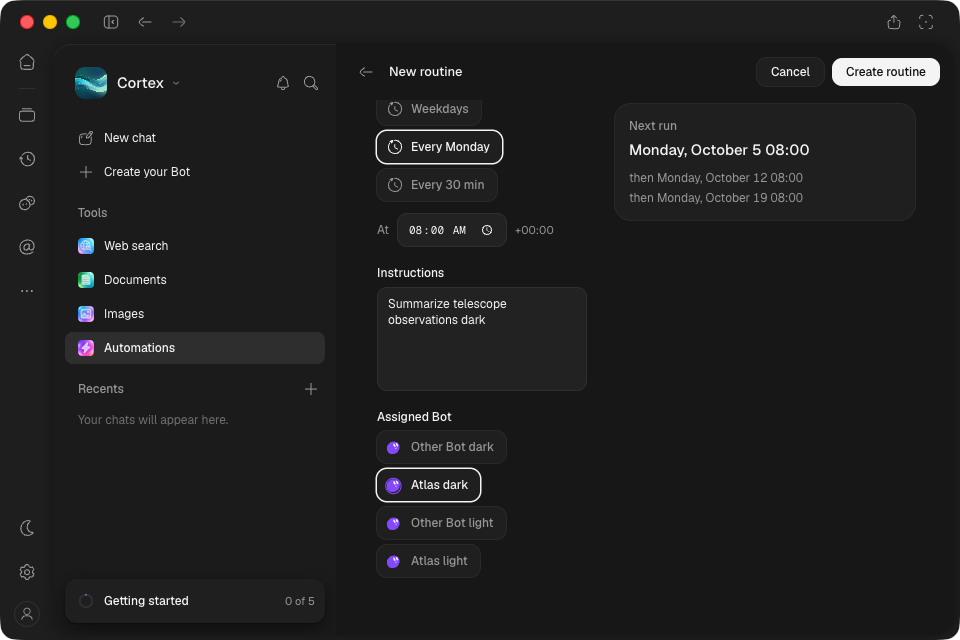
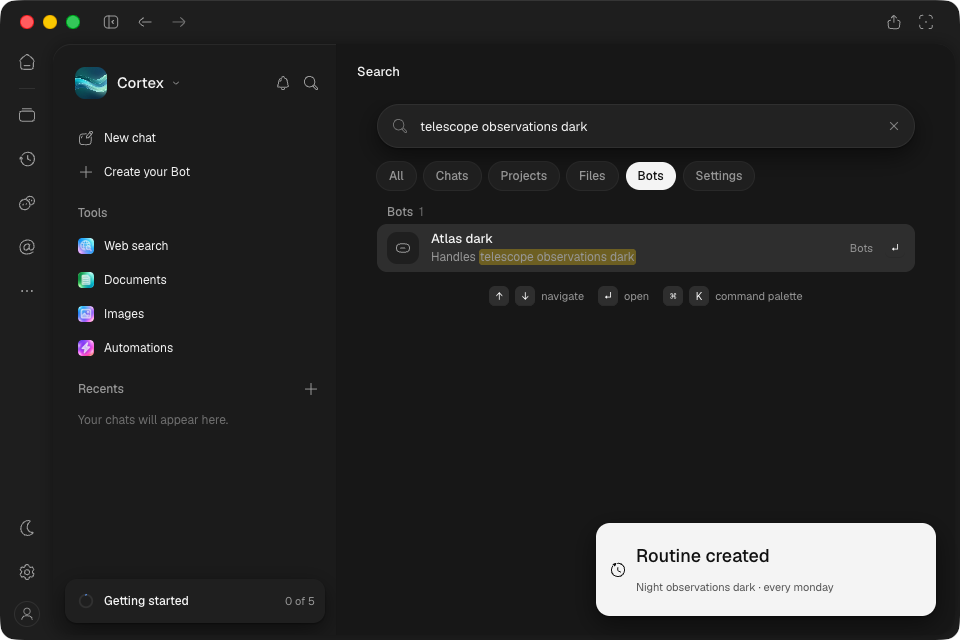

# Installed Mac Work conversion and Bot search — f9aca44

Exact unsigned arm64 artifact **11258159964**, [green CI 37080136101](https://github.com/CortexLM/desktop/actions/runs/37080136101).
Application `f9aca44476fcebd0699c09c9e3f7eebcd5151a2a`.

- ZIP SHA-256: `3e63619e9a16589e396eba1f7b2fb10c92010adfa42ad6d032a5ab7bfa21b9fe`.
- Installed ASAR SHA-256: `23decdd0596b89e8e83284b62f6e7f0eb5314b081ccf178f7dde31c8ac04af77`.
- All 90 embedded build members match the final local build; eight locales × 13 catalogs,
  excluding preview fixtures/source stamps. See `package.json`.
- GUI launch via `open -na /Applications/Cortex.app`; isolated profile/engine and deterministic
  catalog/provider. Previous install retained at `/Applications/Cortex-before-f9aca44.app`.

## Both themes, 960×640, sidebar shown

1. Source task uses a nondefault Bot, Reasoner Large, the `plan` agent and isolated project folder;
   that Bot's default model is Plain Text. Work options prefill the original instructions/Bot.
   Cancel writes no routine.
2. A rewritten Bot-list GET reaches a nonexistent real engine record. Source-specific Bot GET
   and writes remain real. Create disables, localized Retry appears, editable instructions remain.
   Retry restores the selected source Bot and enables Create.
3. Explicit Create persists the original model/agent/directory. Run reaches the controlled
   provider and succeeds; the run session retains the same Bot/model/agent/directory.
4. Bot-filtered persona search finds the saved Bot; Enter opens its exact ID and matching title,
   rather than the newer default Bot. Search results are in view and trial-clickable.

`manifest.json` records six primary captures and both-theme assertions. Its `promptPreserved`
flag describes the editor prefill assertion; the native script does not assert the persisted
task prompt or run text. Persisted-prompt proof belongs to the separate CI tests.
Four controlled inference
requests reach the endpoint: source task plus routine per theme. The provider receipt's `routine`
boolean is only an old prompt-marker heuristic; it is false for these prompts and does not classify
their actual task origin. Persisted run/session assertions establish the two routine executions.
No page errors observed after instrumentation attachment.

The primary editor images cut the selected Bot at the scroll edge. Two minimum-scroll follow-ups
proved viewport/hit access, but dark still met the edge fade. Two centered-scroll captures then
show the complete selected Bot clear of that fade; original images remain intact. These follow-ups
perform no writes, keep the ordinary document scroll, and separately record zero page errors.
All ten native PNGs inspected full-size; `images.json` binds their hashes and dimensions.

## Cleanup and scope

`cleanup.json` verifies ports 9444/9445/9456 closed and the installed ASAR hash. Separate operator
observations: helpers stopped, SSH forwarding closed, ordinary app reopened without test/debug
overrides, Mac lease released. Isolated profiles and earlier packages remain retained.

This is installed-app proof with controlled provider responses. It does not establish real model
understanding, authenticated remote inference, all-screen/native-menu acceptance or signed release.
CI separately covers two-fragment prompts, attachments, deleted sources, stale responses and
same-Bot edit/reload; these native checks do not repeat every one of those cases.

[Independent review](independent-review.md) verifies all ten images, package hash and claim scope;
its prompt-persistence wording finding is corrected above, original manifest retained.
